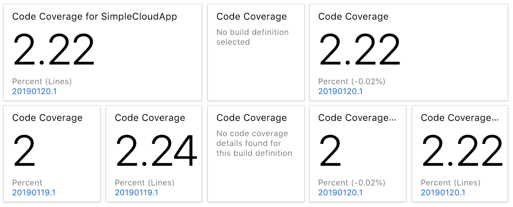
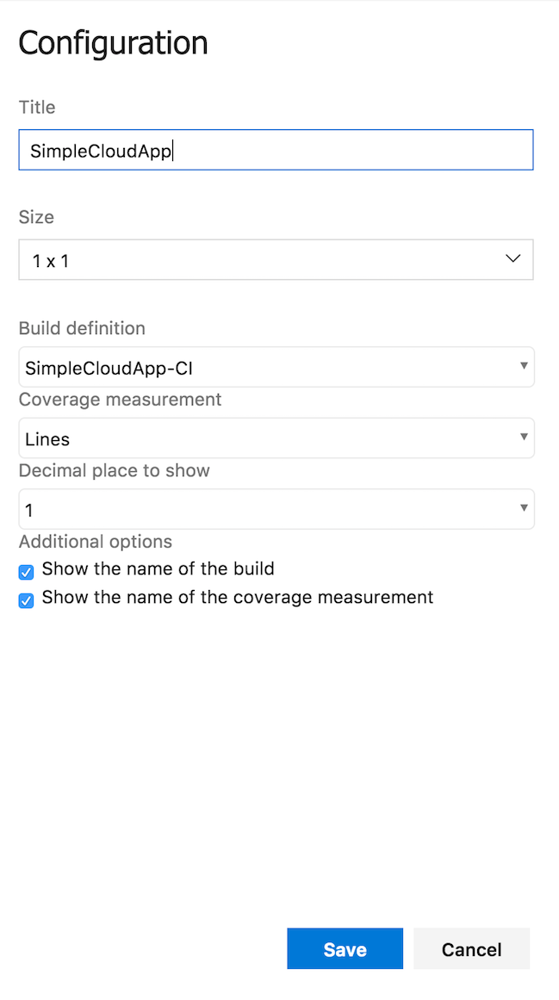

#NOTE: This repository has been archived and is no longer being actively maintained.

# Code Coverage Dashboard Widgets
* NOTE: This works with Azure DevOps and Azure DevOps Server (Team Foundation Server). However, Microsoft requires TFS 2015 Update 3 or higher for folks using Azure DevOps Server (Team Foundation Server).

## Code Coverage Widget
This widget displays the percentage of unit test code coverage based on a selected build definition. If a build definition does not have any unit tests results recognized by the widget or if has not yet been configured, it will indicate so with a message displayed within the widget.

The following configuration options are available:

## Release Notes
* 1.0.272
    * Added configuration option to display delta of previous build's coverage.
    * Updated logo and screenshots.
* 1.0.219
    * Fixed issues where widget would not render properly.
* 1.0.195
    * Added configuration option to display measurement name (via PR from [Tommy Vernieri](https://github.com/Blackbaud-TommyVernieri))
* 1.0.194
    * Added support for Branches (via PR from [Tommy Vernieri](https://github.com/Blackbaud-TommyVernieri))
* 1.0.191
    * Added support for Failed builds that produce code coverage results.
* 1.0.190
    * Added support for Partially Succeeded builds.
* 1.0.189
    * Updated to latest SDK.
    * Minor updates to improve error handling.
* 1.0.171
    * Added configuration option to display up to two decimal places. Zero is the default.
    * Added broader configuration options for broader coverage measurement:
        * Blocks
        * Branch
        * Class
        * Complexity
        * Instruction
        * Line
        * Lines (this is the default)
        * Method
* 1.0.166
    * Added configuration option to measure Lines or Blocks.
* 1.0.162
    * Displayed build name now links to build details.
* 1.0.149
    * Fixed defect where build was not showing as selected.
    * Added configuration option to display build name on widget. 
    * Updated to match native style.
* 1.0.122
    * Widget can now be resized to one or two columns in width.
* 1.0.119
    * Build definitions are now sorted alphabetically.
* 1.0.99
    * Initial release. Includes a single widget that extracts "Line" (.NET) or "Lines" (Java) code coverage results from unit tests executed during a build.

## Known Issues
* Build definitions are limited to the first 1,000. This is a limitation of the Azure DevOps REST API.

## Contributing
If you would like to contribute to these widgets, clone this repository and make your changes. Then submit 
a pull request and I'll review it as soon as possible.

## Issues
If you encounter an issue while using these widgets please open an issue [here](https://github.com/sdavis3/CodeCoverageDashboardWidgets/issues).

## Roadmap
I plan to expand on these widgets to support a wider variety of unit test metrics. Please submit an issue if you have a feature request.
